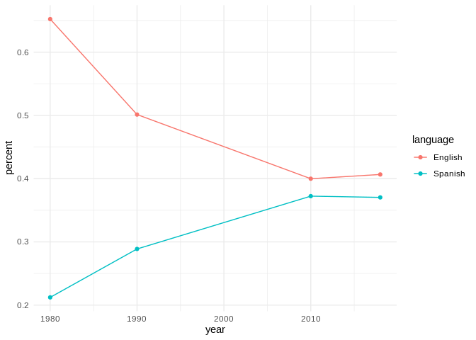
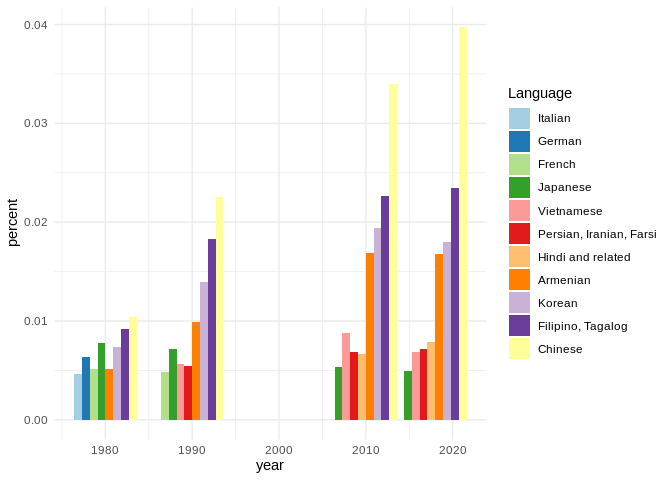

Analyzing L.A. County’s changing languages in Census microdata
================

``` r
library(ipumsr)
```

    ## Registered S3 methods overwritten by 'ipumsr':
    ##   method                                 from 
    ##   format.pillar_shaft_haven_labelled_chr haven
    ##   format.pillar_shaft_haven_labelled_num haven
    ##   pillar_shaft.haven_labelled            haven

``` r
library(tidyverse)
```

    ## ── Attaching packages ──────────────────────────────────────────────────────────────────────────────── tidyverse 1.2.1 ──

    ## ✔ ggplot2 3.2.1     ✔ purrr   0.3.2
    ## ✔ tibble  2.1.3     ✔ dplyr   0.8.3
    ## ✔ tidyr   1.0.0     ✔ stringr 1.4.0
    ## ✔ readr   1.3.1     ✔ forcats 0.4.0

    ## ── Conflicts ─────────────────────────────────────────────────────────────────────────────────── tidyverse_conflicts() ──
    ## ✖ dplyr::filter() masks stats::filter()
    ## ✖ dplyr::lag()    masks stats::lag()

The IPUMS-USA extract comes with two files:

1.  A fixed-width data file in a compressed folder
2.  A data codebook in an XML format, which describes the data based on
    the [Data Documentation Initative](https://ddialliance.org/), or
    “DDI”

<!-- end list -->

``` r
ddi = read_ipums_ddi('data/usa_00009.xml')
data = read_ipums_micro(ddi)
```

    ## Use of data from IPUMS-USA is subject to conditions including that users should
    ## cite the data appropriately. Use command `ipums_conditions()` for more details.

# The codebook

The DDI details the variables in the extract.

``` r
info.variables = ddi$var_info
info.variables
```

    ## # A tibble: 14 x 10
    ##    var_name var_label var_desc val_labels code_instr start   end imp_decim
    ##    <chr>    <chr>     <chr>    <list>     <chr>      <dbl> <dbl>     <dbl>
    ##  1 YEAR     Census y… "YEAR r… <tibble [… <NA>           1     4         0
    ##  2 SAMPLE   IPUMS sa… "SAMPLE… <tibble [… <NA>           5    10         0
    ##  3 SERIAL   Househol… "SERIAL… <tibble [… "\nSERIAL…    11    18         0
    ##  4 CBSERIAL Original… "CBSERI… <tibble [… "\nCBSERI…    19    31         0
    ##  5 HHWT     Househol… "HHWT i… <tibble [… "\nHHWT i…    32    41         2
    ##  6 CLUSTER  Househol… CLUSTER… <tibble [… "\nCLUSTE…    42    54         0
    ##  7 STATEFIP State (F… "STATEF… <tibble [… <NA>          55    56         0
    ##  8 COUNTYF… County (… "COUNTY… <tibble [… "\nCOUNTY…    57    59         0
    ##  9 STRATA   Househol… "STRATA… <tibble [… "\nSTRATA…    60    71         0
    ## 10 GQ       Group qu… "GQ cla… <tibble [… <NA>          72    72         0
    ## 11 PERNUM   Person n… PERNUM … <tibble [… "\n\nPERN…    73    76         0
    ## 12 PERWT    Person w… "PERWT … <tibble [… "\nPERWT …    77    86         2
    ## 13 LANGUAGE Language… LANGUAG… <tibble [… <NA>          87    88         0
    ## 14 LANGUAG… Language… LANGUAG… <tibble [… <NA>          89    92         0
    ## # … with 2 more variables: var_type <chr>, rectypes <lgl>

The key column in this extract is
[LANGUAGE](https://usa.ipums.org/usa-action/variables/LANGUAGE). The
codebook provides the values for every LANGUAGED code.

``` r
info.variables %>% 
  filter(var_name == 'LANGUAGE') %>% 
  `[[`('val_labels')
```

    ## [[1]]
    ## # A tibble: 92 x 2
    ##      val lbl            
    ##    <dbl> <chr>          
    ##  1     0 N/A or blank   
    ##  2     1 English        
    ##  3     2 German         
    ##  4     3 Yiddish, Jewish
    ##  5     4 Dutch          
    ##  6     5 Swedish        
    ##  7     6 Danish         
    ##  8     7 Norwegian      
    ##  9     8 Icelandic      
    ## 10     9 Scandinavian   
    ## # … with 82 more rows

# The data

All of the data in the extract. Most of these come preselected with any
IPUMS extract.

``` r
data %>% head()
```

    ## # A tibble: 6 x 14
    ##    YEAR       SAMPLE SERIAL CBSERIAL  HHWT CLUSTER STATEFIP COUNTYFIP
    ##   <int>    <int+lbl>  <dbl>    <dbl> <dbl>   <dbl> <int+lb> <dbl+lbl>
    ## 1  1980 198001 [198… 192089       NA    20 1.98e12 6 [Cali…      2323
    ## 2  1980 198001 [198… 192089       NA    20 1.98e12 6 [Cali…      2323
    ## 3  1980 198001 [198… 192089       NA    20 1.98e12 6 [Cali…      2323
    ## 4  1980 198001 [198… 192089       NA    20 1.98e12 6 [Cali…      2323
    ## 5  1980 198001 [198… 192089       NA    20 1.98e12 6 [Cali…      2323
    ## 6  1980 198001 [198… 192090       NA    20 1.98e12 6 [Cali…      2323
    ## # … with 6 more variables: STRATA <dbl>, GQ <int+lbl>, PERNUM <dbl>,
    ## #   PERWT <dbl>, LANGUAGE <int+lbl>, LANGUAGED <int+lbl>

The data is already filtered down to California. Filter it down again to
just L.A. County, then keep only the relevant columns.

``` r
la.data = data %>% 
  filter(COUNTYFIP == 37) %>% 
  select(YEAR, LANGUAGE, PERWT)

la.data %>% head()
```

    ## # A tibble: 6 x 3
    ##    YEAR    LANGUAGE PERWT
    ##   <int>   <int+lbl> <dbl>
    ## 1  1980 1 [English]    20
    ## 2  1980 1 [English]    20
    ## 3  1980 1 [English]    20
    ## 4  1980 1 [English]    20
    ## 5  1980 1 [English]    20
    ## 6  1980 1 [English]    20

[PERWT](https://usa.ipums.org/usa-action/variables/PERWT#description_section)
is the approxmiation of how many people this line of data represents. In
this case, it would be the approximate amount of people speaking that
language. It needs to be aggregated and summed to get total counts for
the language.

``` r
la.data.agg = la.data %>% 
  group_by(YEAR, LANGUAGE) %>% 
  summarise(PERWT = sum(PERWT))

la.data.agg %>% head()
```

    ## # A tibble: 6 x 3
    ## # Groups:   YEAR [1]
    ##    YEAR            LANGUAGE   PERWT
    ##   <int>           <int+lbl>   <dbl>
    ## 1  1980 0 [N/A or blank]     346500
    ## 2  1980 1 [English]         4888960
    ## 3  1980 2 [German]            47660
    ## 4  1980 3 [Yiddish, Jewish]   18900
    ## 5  1980 4 [Dutch]             13560
    ## 6  1980 5 [Swedish]            3780

Reformat the data, separating the labels from the code, plus add a
column for the percent of the population speaking that language in each
year.

``` r
la.languages = la.data.agg %>% 
  group_by(YEAR) %>% 
  mutate(percent = PERWT / sum(PERWT)) %>% 
  ungroup(YEAR) %>% 
  transmute(
    year = YEAR,
    langcode = zap_labels(LANGUAGE),
    language = as_factor(LANGUAGE),
    total = PERWT,
    percent
  )

la.languages %>% head()
```

    ## # A tibble: 6 x 5
    ##    year langcode language          total  percent
    ##   <int>    <int> <fct>             <dbl>    <dbl>
    ## 1  1980        0 N/A or blank     346500 0.0462  
    ## 2  1980        1 English         4888960 0.652   
    ## 3  1980        2 German            47660 0.00636 
    ## 4  1980        3 Yiddish, Jewish   18900 0.00252 
    ## 5  1980        4 Dutch             13560 0.00181 
    ## 6  1980        5 Swedish            3780 0.000504

What were the top 10 languages spoken in 1980?

``` r
la.languages %>% 
  filter(langcode != 0) %>% 
  filter(year == 1980) %>% 
  arrange(-total) %>% 
  head(10)
```

    ## # A tibble: 10 x 5
    ##     year langcode language            total percent
    ##    <int>    <int> <fct>               <dbl>   <dbl>
    ##  1  1980        1 English           4888960 0.652  
    ##  2  1980       12 Spanish           1591000 0.212  
    ##  3  1980       43 Chinese             77920 0.0104 
    ##  4  1980       54 Filipino, Tagalog   68700 0.00917
    ##  5  1980       48 Japanese            58280 0.00778
    ##  6  1980       49 Korean              55000 0.00734
    ##  7  1980        2 German              47660 0.00636
    ##  8  1980       11 French              38800 0.00518
    ##  9  1980       28 Armenian            38600 0.00515
    ## 10  1980       10 Italian             34940 0.00466

What were the top 10 languages spoken in 2018?

``` r
la.languages %>% 
  filter(langcode != 0) %>% 
  filter(year == 2018) %>% 
  arrange(-total) %>% 
  head(10)
```

    ## # A tibble: 10 x 5
    ##     year langcode language                  total percent
    ##    <int>    <int> <fct>                     <dbl>   <dbl>
    ##  1  2018        1 English                 4108477 0.407  
    ##  2  2018       12 Spanish                 3741860 0.370  
    ##  3  2018       43 Chinese                  401703 0.0398 
    ##  4  2018       54 Filipino, Tagalog        236587 0.0234 
    ##  5  2018       49 Korean                   181622 0.0180 
    ##  6  2018       28 Armenian                 169458 0.0168 
    ##  7  2018       31 Hindi and related         79249 0.00784
    ##  8  2018       29 Persian, Iranian, Farsi   72613 0.00719
    ##  9  2018       50 Vietnamese                69346 0.00686
    ## 10  2018       48 Japanese                  49664 0.00492

How have English and Spanish, far and away the top languages, changed
over time?

``` r
la.languages %>% 
  filter(language %in% c('English', 'Spanish')) %>% 
  ggplot(aes(year, percent, color = language)) +
  geom_line() +
  geom_point() +
  theme_minimal()
```

<!-- -->

How about the other languages?

Start by keeping any language that has been in the top 10 for a
particular year.

``` r
top.10.yearly = la.languages %>% 
  filter(langcode != 0) %>% 
  group_by(year) %>% 
  mutate(rankinyear = rank(-total)) %>% 
  ungroup(year) %>% 
  filter(rankinyear <= 10)

top.10.yearly %>% head()
```

    ## # A tibble: 6 x 6
    ##    year langcode language   total percent rankinyear
    ##   <int>    <int> <fct>      <dbl>   <dbl>      <dbl>
    ## 1  1980        1 English  4888960 0.652            1
    ## 2  1980        2 German     47660 0.00636          7
    ## 3  1980       10 Italian    34940 0.00466         10
    ## 4  1980       11 French     38800 0.00518          8
    ## 5  1980       12 Spanish  1591000 0.212            2
    ## 6  1980       28 Armenian   38600 0.00515          9

``` r
unique(top.10.yearly$language)
```

    ##  [1] English                 German                 
    ##  [3] Italian                 French                 
    ##  [5] Spanish                 Armenian               
    ##  [7] Chinese                 Japanese               
    ##  [9] Korean                  Filipino, Tagalog      
    ## [11] Persian, Iranian, Farsi Vietnamese             
    ## [13] Hindi and related      
    ## 92 Levels: N/A or blank English German Yiddish, Jewish Dutch ... Other or not reported

``` r
top.10.yearly %>%
  filter(!language %in% c('English', 'Spanish')) %>% 
  arrange(-year, -total) %>% 
  # control ordering
  mutate(language = language %>% as.character() %>% fct_inorder() %>% fct_rev()) %>% 
  ggplot(aes(year, percent, fill = language)) +
  geom_bar(stat = 'identity', position = 'dodge') +
  scale_fill_brewer(palette = "Paired", name = 'Language') +
  theme_minimal()
```

<!-- -->
